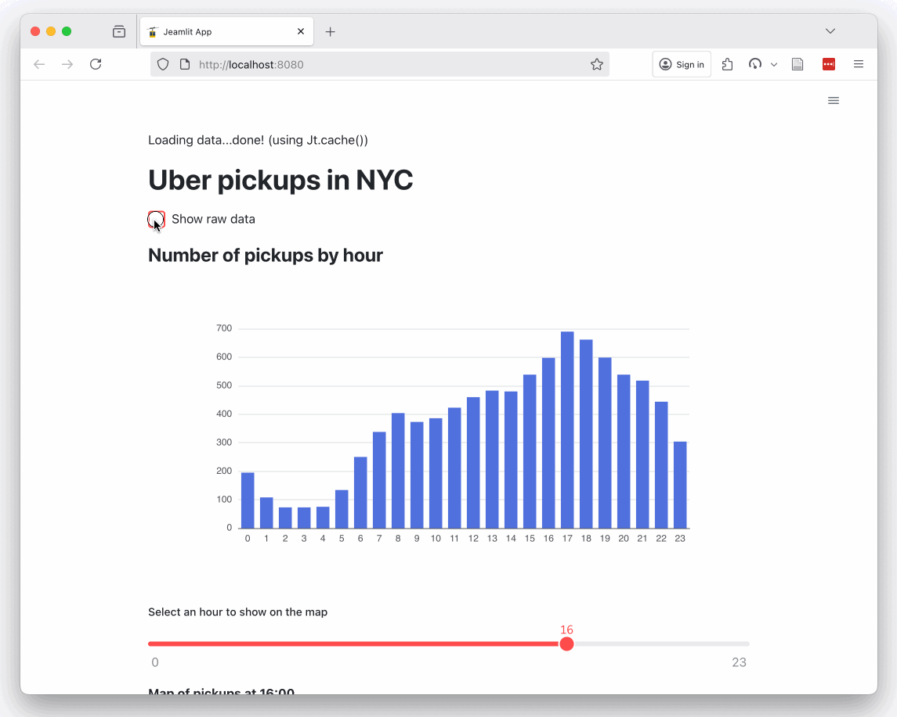
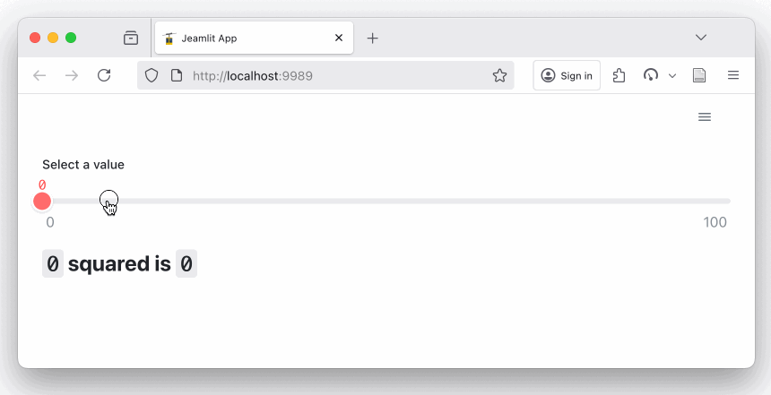

# Javelit <span style="transform: scale(-1,1); display:inline-block;">🚡</span>

Welcome! 
## What is Javelit ? 
Javelit is a **Java** *lightning fast* data app development framework, heavily inspired by Streamlit.  

Javelit makes it dead simple to create data apps **in minutes**. 
Build dashboards, back-offices, generate reports, showcase APIS, etc...   
**The best part?** You can run your Javelit app standalone, or **embed it right into your existing Java project**.

</img>

*Not convinced? It's ok. Read the [Oh No! Another high-level framework](#oh-no-another-high-level-framework) and [Shouldn't I use Streamlit?](#shouldnt-i-use-streamlit) sections.*

- [Install](#install)
- [Get Started](#quickstart)
- [Documentation](https://docs.javelit.io/) 
- [Components](https://docs.javelit.io/develop/api-reference).
- [Forum](https://github.com/javelit/javelit/discussions/)
- [Roadmap](https://github.com/javelit/javelit/discussions/39)
- [Dev Diary](https://world.hey.com/cdecatheu)

## Install

Javelit requires A Java JDK >= `21`.

There are 2 main ways to install and run Javelit:
- as a **standalone** CLI and app runner
- **embedded** in an existing Java project

You'll find a short version below. [Read the doc](https://docs.javelit.io/get-started/installation) to get more details for each method.


### Standalone
1. Install the CLI ([JBang](https://www.jbang.dev/) is highly recommended)
    ```bash
    # recommended: install with jbang
    jbang app install javelit@javelit

    # vanilla
    curl -L -o javelit.jar https://repo1.maven.org/maven2/io/javelit/javelit/0.68.0/javelit-0.68.0-all.jar
    ```
2. Validate the installation by running the Hello app:
   ```bash
   # jbang
   javelit hello
   
   # vanilla
   java -jar javelit.jar hello
   ```
3. Play with the Hello World!
5. Want to see a fancier app ? 
   ```bash
   javelit run https://raw.githubusercontent.com/javelit/javelit/main/examples/getting_started/App.java
   ```

Find more details in the [standalone installation doc](https://docs.javelit.io/get-started/installation/standalone). 
**Don't forget to install the [JBang IDE plugin](https://docs.javelit.io/get-started/installation/standalone#prerequisites) for completion and highlighting!** 

Once you're ready to go further, look at the [fundamental concepts](https://docs.javelit.io/get-started/fundamentals) or jump straight into [creating your first app](https://docs.javelit.io/get-started/tutorials/create-an-app). 

### Embedded server
1. Add the dependency to your project
   ```xml
   <dependency>
       <groupId>io.javelit</groupId>
       <artifactId>javelit</artifactId>
       <version>0.68.0</version>
   </dependency>
   ```
2. Launch the server in your project
   ```java
   void startServer() {
     // prepare a Javelit server
     var server = Server.builder(() -> app(), 8888).build();
    
     // start the server - this is non-blocking, user thread
     server.start();
   }
   
   // the Javelit webapp
   void  app() {
     Jt.text("Hello World").use();
   }
   ```

Find more details in the [embedded installation doc](https://docs.javelit.io/get-started/installation/embedded-vanilla#development-with-hot-reload).
**Don't forget to look at the [IDE hot-reload setup](https://docs.javelit.io/get-started/installation/embedded-vanilla#development-with-hot-reload)!**

Once you're ready to go further, look at the [fundamental concepts](https://docs.javelit.io/get-started/fundamentals) or jump straight into [creating your first app](https://docs.javelit.io/get-started/tutorials/create-an-app).


## Quickstart
Create a new file named App.java in your project directory with the following code:

```java
import io.javelit.core.Jt;

public class App {
    public static void main(String[] args) {
        int x = Jt.slider("Select a value").use().intValue();
        Jt.markdown("## `%s` squared is `%s`".formatted(x, x * x)).use();
    }
}
```

Run it:
```
javelit run App.java
```

</img>

Want more ?
look at the [fundamental concepts](https://docs.javelit.io/get-started/fundamentals), jump straight into [creating your first app](https://docs.javelit.io/get-started/tutorials/create-an-app).   
Not ambitious enough? Create a LangChain4J AI [multipage app](https://docs.javelit.io/get-started/tutorials/create-a-multipage-app). 

## Oh, No! Another high-level framework
Javelit is **not** another abstraction layer that hides the HTML/CSS/Javascript. 
That alone is not enough to significantly improve productivity. 
The real pain is in **bindings**: handling events, reacting to changes, passing messages, 
parsing results... you get it.
 

**Javelit promise is to remove all of that.**

Here is an example:
```
double size = Jt.slider("How tall are you ? in cm").max(220).use();
if (size > 200) {
    Jt.text("Damn, that huge!").use();
}
```

That's it. That's the **entire** webapp code. Move the slider, and the size variable immediately 
reflects the latest frontend value.
What's the execution order then ? Top-to-bottom. Every time something changes in the app, 
the logic re-runs from top to bottom, using the most up-to-date values from the frontend.
  
We hope this sparks your curiosity!

*By the way, once you have javelit [installed](#install), you can run this example with*
```bash
javelit run https://raw.githubusercontent.com/javelit/javelit/refs/heads/main/examples/readme/App.java 
```

## Shouldn't I use Streamlit?
Javelit: 
- is Java-native
- can be embedded directly into your existing Java project. 

If neither of those points matters to you... well, farewell. You should use [Streamlit](https://streamlit.io/).   
If you're still there: thanks. There are plenty of smaller differences that make Javelit worth a try: simpler state management, 
easier custom components, and more.

## Contribute
Really? Thanks for you interest in improving Javelit! <span style="transform: scale(-1,1); display:inline-block;">🚡</span>  
To start a discussion, open an [issue](https://github.com/javelit/javelit/issues) or a thread in the [forum](https://github.com/javelit/javelit/discussions).   
For development, see [DEVELOPMENT.md](DEVELOPMENT.md).

## License
Javelit is free and open-source, licensed under the [Apache 2.0 license](LICENSE).
